# AlertSoon
AlertSoon App is alarm app. Inside this you can create 2 different types of alarm 1. one time and 2. regular 
before that lets see the ui of application we have 2 modes dark and light.

## Feature's
1. Create alarm (one time or regular) 
2. Select your lead icon
3. Snooze alarm
4. Dark and light theme
5. Select your favourite system ringtone

## Create alarm (one time or regular)

Open create task section by follow below steps 
1. Dashboard -> Top Right "+" Icon -> you inside the create task section 

Now follow below steps to create alarm for your requirement

| One time alarm                                                     | Regular alarm                                                     |
|--------------------------------------------------------------------|-------------------------------------------------------------------|
| 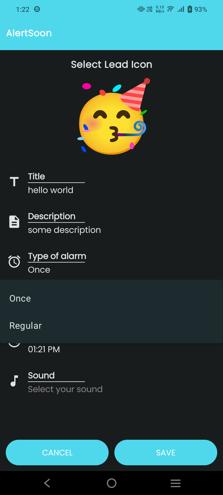  | 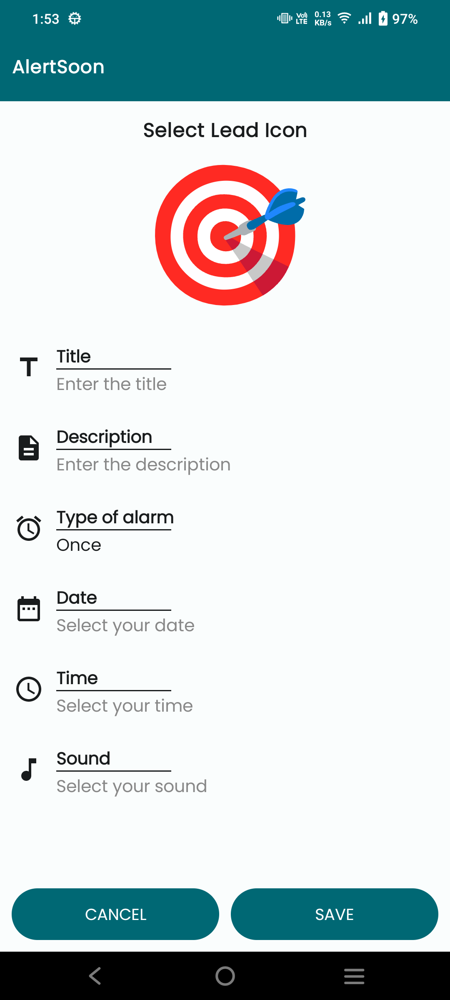  |
| 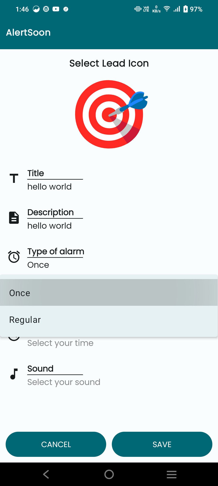  | 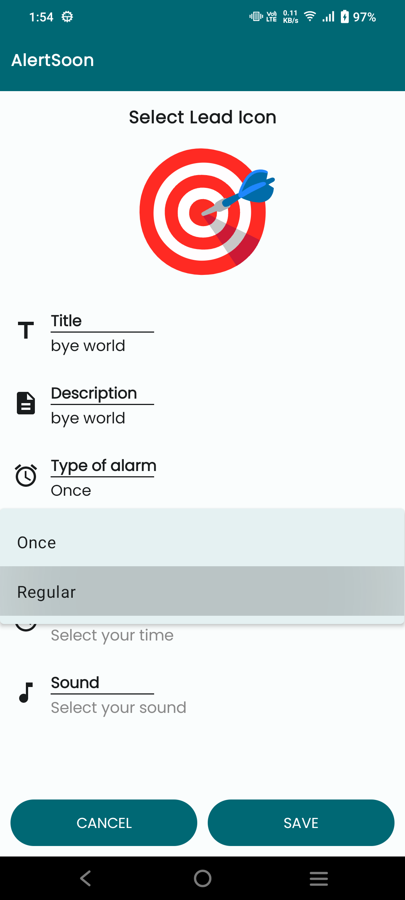  |
| 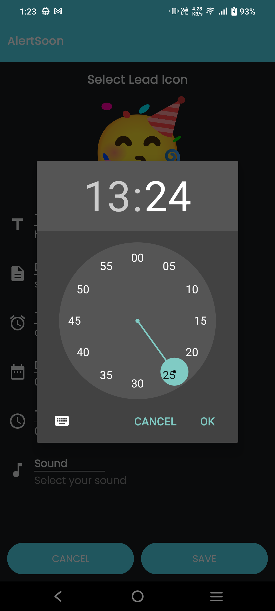  | 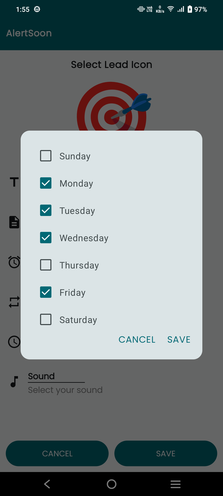  |
| 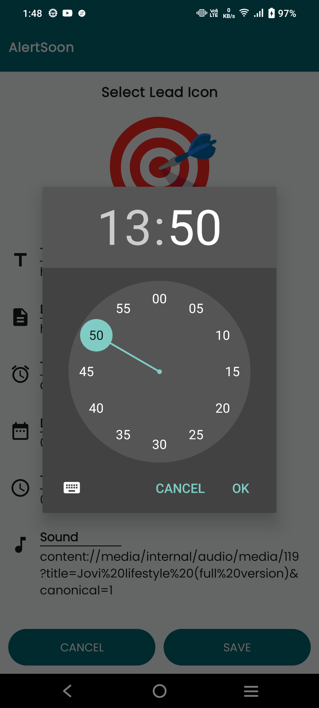  | 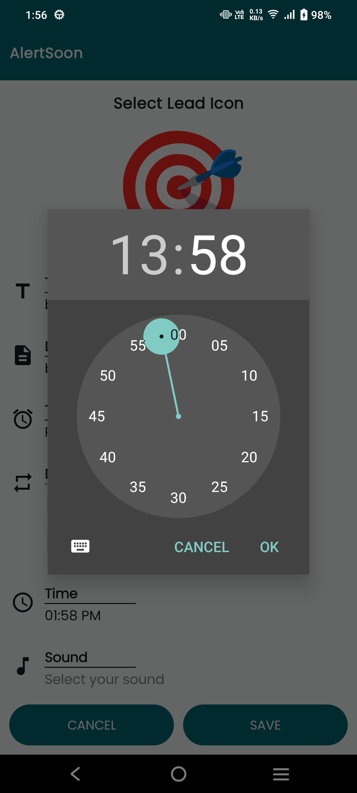  |
| 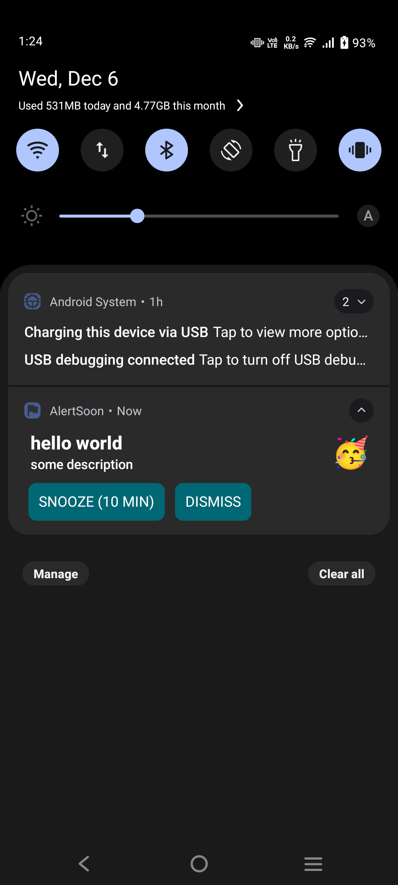  | 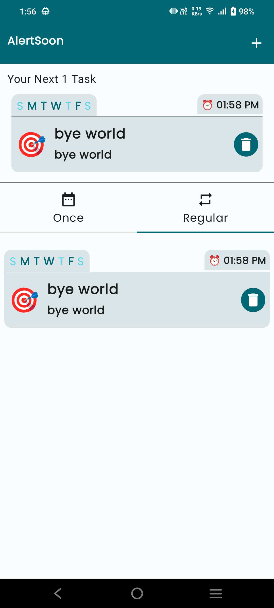 |
| 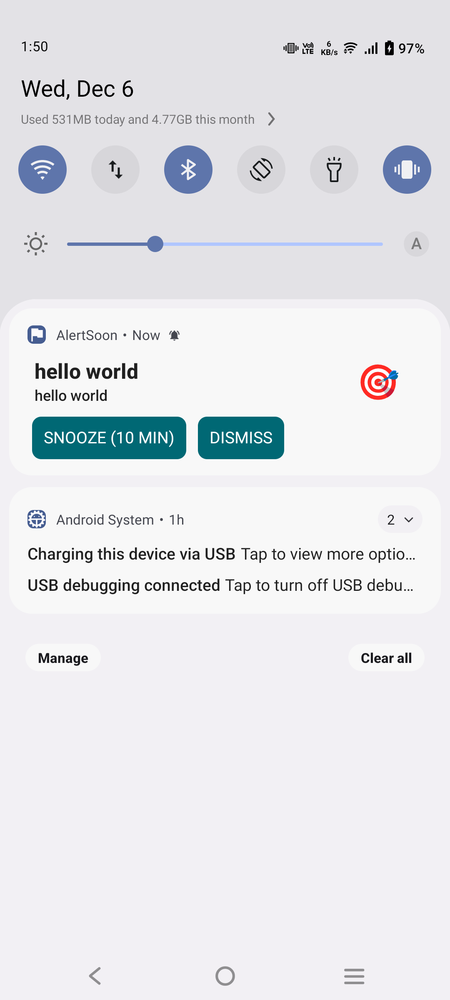 | 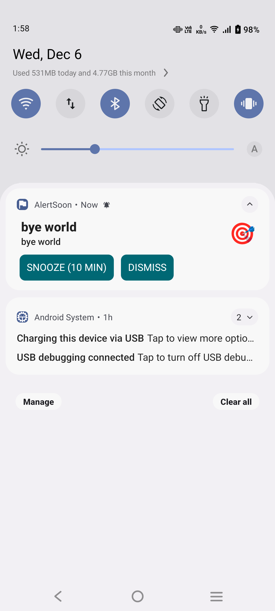 |

## for selecting favourite ringtone for below step
1. Create task section -> Sound -> Select your alarm sound -> Press back
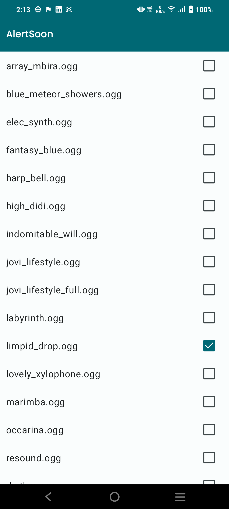

## light mode
       

## dark mode
       
