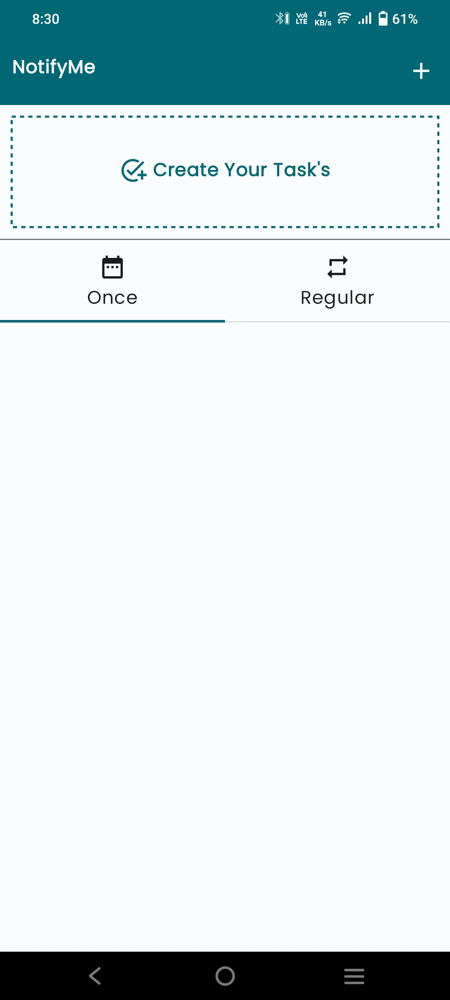
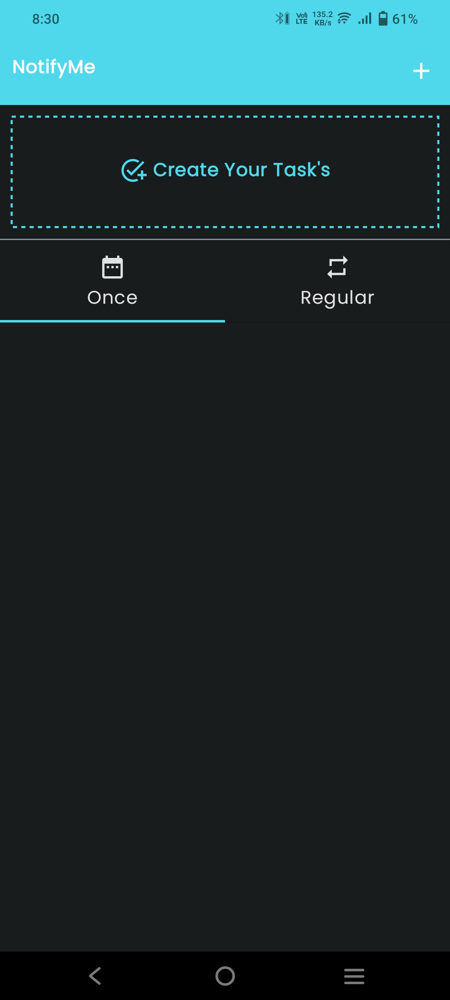

# NotifyMe
NotifyMe App is alarm app. Inside this you can create 2 different types of alarm 1. one time and 2. regular 
before that lets see the ui of application we have 2 modes dark and light.

## light mode
   
   
## dark mode
   

   
