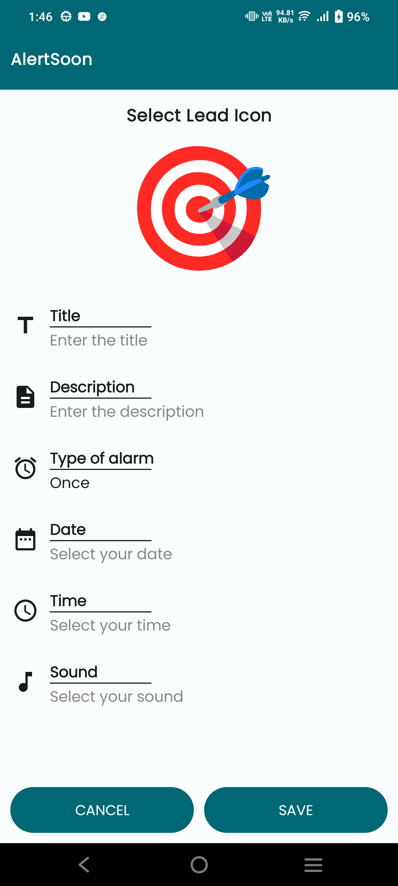
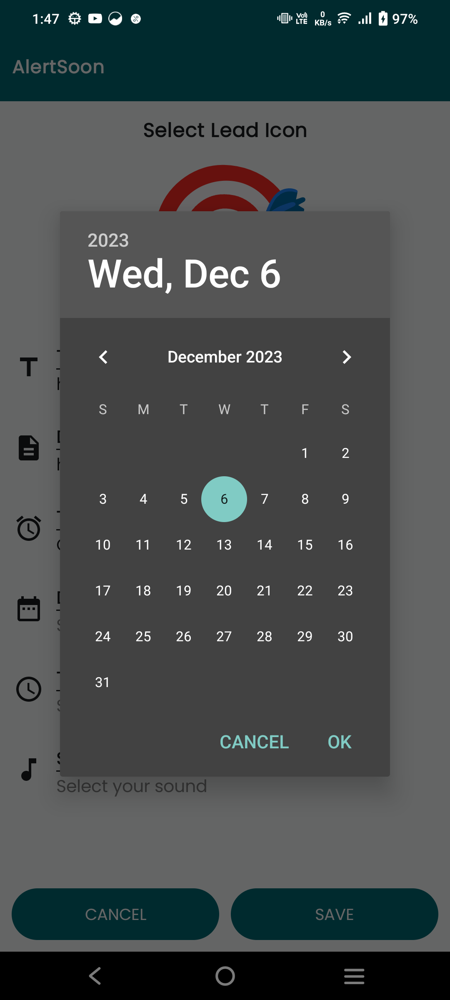
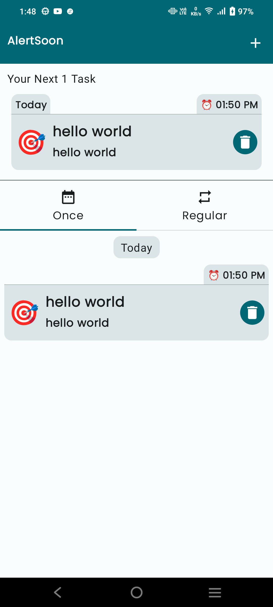
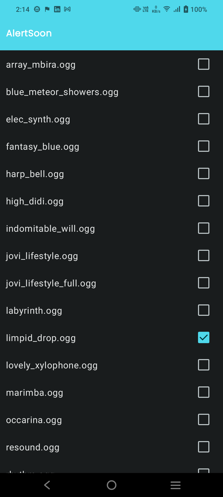

# AlertSoon
AlertSoon App is alarm app. Inside this you can create 2 different types of alarm 1. one time and 2. regular 
before that lets see the ui of application we have 2 modes dark and light.

## Feature's
1. Create alarm (one time or regular) 
2. Select your lead icon
3. Snooze alarm
4. Dark and light theme
5. Select your favourite system ringtone

## Create alarm (one time or regular)

Open create task section by follow below steps 
1. Dashboard -> Top Right "+" Icon -> you inside the create task section 

Now follow below steps to create alarm for your requirement

| One time alarm                                                                                                              | Regular alarm                                                                                                              |
|-----------------------------------------------------------------------------------------------------------------------------|----------------------------------------------------------------------------------------------------------------------------|
| open create task section                           | open create task section                           |
| select "Once" option in  "Type of alarm"           | select "Rgular" option in  "Type of alarm"         |
| select Date                                        | select Day's                                       |
| select Time       Now save it                   | select Time        Now save it                  |
| Now you can see the one time task in dashboard     | Now you can see the regular task in dashboard     |
| This is a notification which you received         | This is a notification which you received         |

## For selecting favourite ringtone for below step
1. Create task section -> Sound -> Select your alarm sound -> Press back

## Light mode
       

## Dark mode
       
